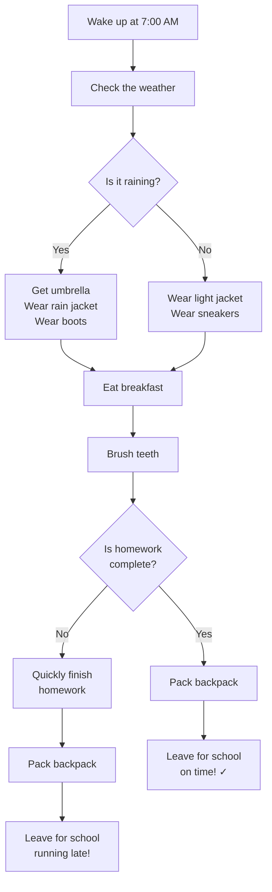

# Workflow Visualization Guide

This guide shows different ways to visualize workflows with decision points using Markdown.

All examples use a simple scenario: **Getting ready for school in the morning**

---

## Option 1: Numbered List with Indentation

This approach uses numbered lists with indentation to show different paths.

### Morning Routine Workflow

1. Wake up at 7:00 AM
2. Check the weather
   - **If it's raining:**
     1. Get umbrella from closet
     2. Wear rain jacket
     3. Wear boots
   - **If it's sunny:**
     1. Wear light jacket
     2. Wear sneakers
3. Eat breakfast
4. Brush teeth
5. Check if you have homework
   - **If homework is complete:**
     1. Pack backpack
     2. Leave for school
   - **If homework is NOT complete:**
     1. Quickly finish homework
     2. Pack backpack
     3. Leave for school (might be late!)

---

## Option 2: Checkbox Task Lists with Paths

This approach uses checkboxes to show steps, with clear labels for different paths.

### Morning Routine Workflow

- [ ] Wake up at 7:00 AM
- [ ] Check the weather

**Path A: Rainy Weather**
- [ ] Get umbrella from closet
- [ ] Wear rain jacket
- [ ] Wear boots

**Path B: Sunny Weather**
- [ ] Wear light jacket
- [ ] Wear sneakers

**Continue for Both Paths:**
- [ ] Eat breakfast
- [ ] Brush teeth
- [ ] Check if homework is complete

**Decision Point - Homework Status:**

**Path 1: Homework Complete ✓**
- [ ] Pack backpack
- [ ] Leave for school on time

**Path 2: Homework Not Complete ✗**
- [ ] Quickly finish homework
- [ ] Pack backpack
- [ ] Leave for school (running late!)

---

## Option 3: Table-Based Workflow

This approach uses tables to show steps and different outcomes.

### Morning Routine Workflow

| Step | Action | Decision Point | Path A | Path B |
|------|--------|----------------|--------|--------|
| 1 | Wake up at 7:00 AM | - | Continue | Continue |
| 2 | Check the weather | Weather? | Rainy → Step 3A | Sunny → Step 3B |
| 3A | Rain gear | - | Get umbrella, rain jacket, boots | - |
| 3B | Sun gear | - | - | Wear light jacket, sneakers |
| 4 | Eat breakfast | - | Continue | Continue |
| 5 | Brush teeth | - | Continue | Continue |
| 6 | Check homework | Homework done? | Complete → Step 7A | Not complete → Step 7B |
| 7A | Ready to go | - | Pack backpack, leave on time | - |
| 7B | Need to finish | - | - | Finish homework, pack, leave late |

---

## Option 4: Mermaid Flowchart (Visual Diagram)

This approach creates an actual flowchart diagram. GitHub and VS Code can both render Mermaid diagrams.

### Morning Routine Workflow



---

## Option 5: ASCII Art Flow with Arrows

This approach uses simple text characters to create a visual flow.

### Morning Routine Workflow

```
START
  |
  v
[Wake up at 7:00 AM]
  |
  v
[Check the weather]
  |
  v
  /-----------------\
  |   Is it raining?  |
  \-----------------/
      |           |
    YES          NO
      |           |
      v           v
  [Get rain     [Wear light
   gear]         jacket]
      |           |
      \-----------/
           |
           v
    [Eat breakfast]
           |
           v
    [Brush teeth]
           |
           v
    /-----------------\
    |  Homework done?  |
    \-----------------/
         |          |
       YES         NO
         |          |
         v          v
    [Pack bag]  [Finish homework]
         |          |
         v          v
    [Leave on   [Pack & leave
     time ✓]     late ⚠]
         |          |
         \----------/
              |
              v
            END
```

---

## Option 6: Blockquote with Emojis for Clarity

This approach uses blockquotes and emojis to make decisions stand out.

### Morning Routine Workflow

**Step 1:** Wake up at 7:00 AM ⏰

**Step 2:** Check the weather 🌤️

> 🔀 **DECISION: Weather Check**
> 
> ☔ **If RAINY:**
> - Get umbrella from closet
> - Wear rain jacket
> - Wear boots
>
> ☀️ **If SUNNY:**
> - Wear light jacket
> - Wear sneakers

**Step 3:** Eat breakfast 🥣

**Step 4:** Brush teeth 🪥

> 🔀 **DECISION: Homework Status**
>
> ✅ **If COMPLETE:**
> - Pack backpack
> - Leave for school on time
>
> ❌ **If NOT COMPLETE:**
> - Quickly finish homework
> - Pack backpack
> - Leave for school (might be late!)

**END** 🏫

---

## Which Option Should You Use?

**Choose based on your needs:**

- **Option 1 (Numbered Lists)**: Best for simple workflows, easy to type
- **Option 2 (Checkboxes)**: Best for actionable task lists you can check off
- **Option 3 (Tables)**: Best when comparing multiple paths side-by-side
- **Option 4 (Mermaid)**: Best for visual learners, most professional looking
- **Option 5 (ASCII Art)**: Best when you can't use Mermaid but want visual flow
- **Option 6 (Blockquotes)**: Best for emphasis on decision points

**Pro Tip:** You can combine multiple approaches! For example, use Mermaid for overview and numbered lists for detailed steps.

---

## Testing Compatibility

✅ All options in this guide work in:
- GitHub (when viewing .md files)
- VS Code (with Markdown preview)
- Most modern Markdown editors

⚠️ Note: Mermaid diagrams require the viewer to support Mermaid syntax (GitHub and VS Code both do by default).
